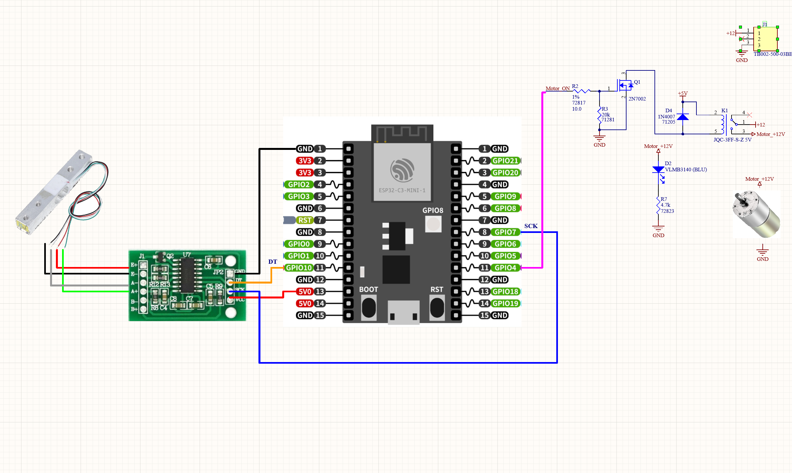
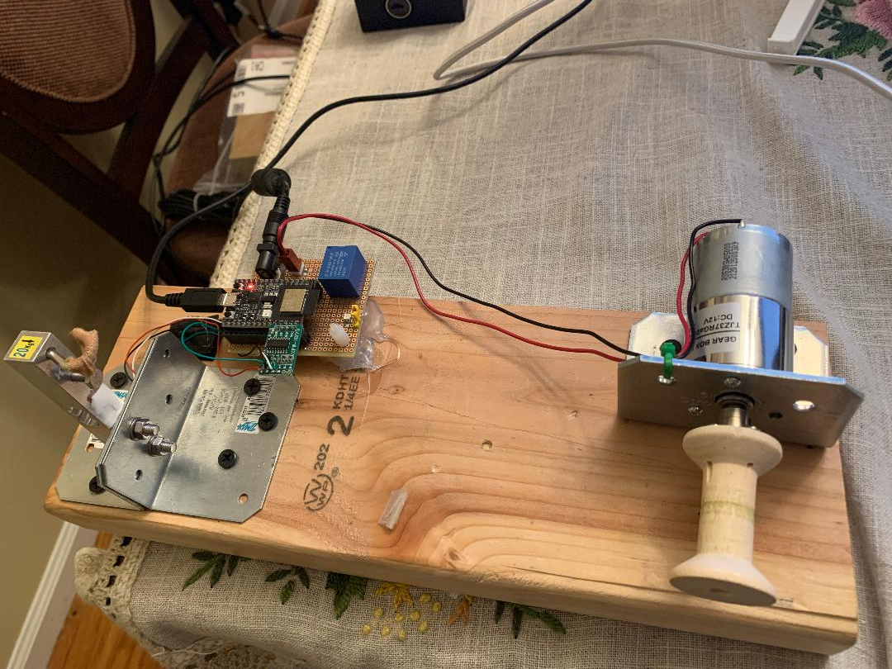

# Fishing_Line_Knots_Tester
 Fixture made for testing fishing line and knots
 

Parts used:
1. 20Kg Digital Load Cell Weight Sensor

   https://www.aliexpress.com/item/32873035643.html?spm=a2g0o.9042311.0.0.27424c4d4NKtJa

2. OLYCRAFT 20PCS Wooden Empty Spool

   https://www.amazon.com/gp/product/B08HLVW99G/ref=ppx_yo_dt_b_asin_title_o08_s00?ie=UTF8&psc=1

3. PLUMIA DC 12V 20RPM Gear Motor Centric Output Shaft 37mm Diameter Gearbox High Torque Electric Micro Speed Reduction Geared Motor

   https://www.amazon.com/Greartisan-Electric-Reduction-Centric-Diameter/dp/B07K9KPWX6/ref=asc_df_B07K9KPWX6/?tag=hyprod-   20&linkCode=df0&hvadid=312765622753&hvpos=&hvnetw=g&hvrand=7307868650312039379&hvpone=&hvptwo=&hvqmt=&hvdev=c&hvdvcmdl=&hvlocint=&hvlocphy=9004541&hvtargid=pla-609460311764&th=1

4. 6mm Flange Coupling Connector

   https://www.amazon.com/gp/product/B08334N261/ref=ppx_yo_dt_b_asin_title_o09_s00?ie=UTF8&th=1

5. ESP32-C3-DevKitM 

   https://www.mouser.com/ProductDetail/Espressif-Systems/ESP32-C3-DevKitM-1?qs=pUKx8fyJudB1sOWbbEnGFw%3D%3D

6. 12V5A AC-DC Adapter

   https://www.amazon.com/Gonine-Adapter-Switching-Connector-Computer/dp/B07Q7N14ZY/ref=sr_1_8?  crid=31YX8UQ8QUPK3&keywords=12V+5A+Power+Adapter&qid=1644898752&s=electronics&sprefix=12v+5a+power+adapter%2Celectronics%2C41&sr=1-8
